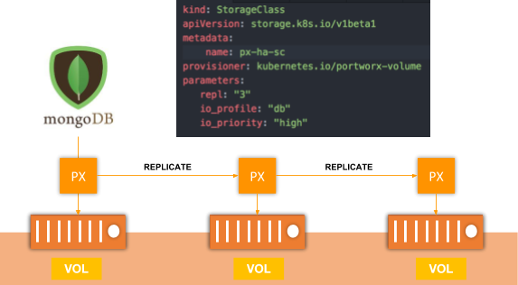

Multiplos recursos usando "count" conforme documentação: https://www.terraform.io/docs/configuration/resources.html

Chave ppk for Putty/Windows: https://www.tbs-certificates.co.uk/FAQ/en/putty-ppk-vers-openssl-openssh.html

Discos (Elastic Block Storage) para replicação através do Portworx

